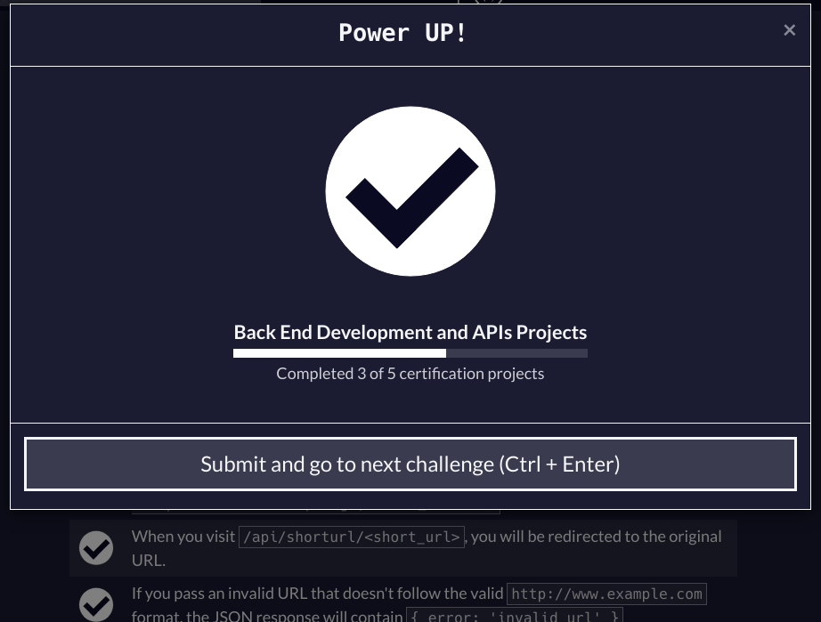

A Url shortener microservice made during **FreeCodeCamp** [Back End Development and APIs course](https://www.freecodecamp.org/learn/back-end-development-and-apis).




## Test Scenario:
- [x] Use dns module
- [x] Post a url in /api/shorturl and get a response with **original_url** and **short_url**
- [x] When you visit /api/shorturl/<short_url>, you will be redirected to the original URL.
- [x] If you pass an invalid URL need return **{ error: 'invalid url' }**

## Helpful resources

- [Node.js DNS](https://nodejs.org/api/dns.html#dnslookuphostname-options-callback)

- [Node.js URL](https://nodejs.org/api/url.html)

- [Mongoose](https://mongoosejs.com/)

- [Nano ID](https://github.com/ai/nanoid/)

## How test

You have 2 example of request in app.http you could use REST Client ou another tool.

#### Shorten url request:

```js
POST
https://url-shortener-uzv4.onrender.com/api/shorturl
Content-Type: application/x-www-form-urlencoded

// A url form encoded
url=https://edlavio.eu.org
```

#### Getting shortened url:

```js
GET

// After shorturl/put_here_short_url
https://url-shortener-uzv4.onrender.com/api/shorturl/534447

// Open in Browser and will redirect to https://github.com/Edlavio
```

## How setup

You will need [pnpm](https://pnpm.io/) and Node.js and some API test tool (Postman, Imsomnia, Thunder Client, Httpie or REST Client).

You will need also setup a **Mongo Database** and create a **.env** file you have **.env.sample** as example.

```bash
# To install the dependencies
pnpm i
```

```bash
# To run de project
pnpm dev
```
